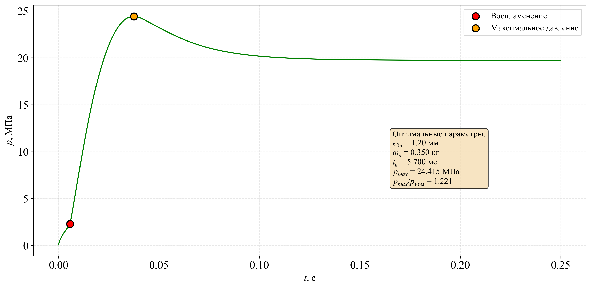

markdown

# 🚀 Комплексное исследование и оптимизация характеристик РДТТ

> **Цель проекта:** Разработка и оптимизация модели ракетного двигателя на твердом топливе (РДТТ) для авиационной аэробаллистической ракеты Х-15. Проект охватывает полный цикл исследования: от численного моделирования физических процессов до анализа чувствительности и вывода инженерных формул.

---

## 📋 Содержание

1.  [**Обзор проекта**](#обзор-проекта)
2.  [**Основные задачи**](#основные-задачи)
3.  [**Структура репозитория**](#структура-репозитория)
4.  [**Методология**](#методология)
    - [1. Геометрия заряда](#1-геометрия-заряда)
    - [2. Воспламенение](#2-воспламенение)
    - [3. Внутренняя баллистика](#3-внутренняя-баллистика)
    - [4. Оптимизация](#4-оптимизация)
    - [5. Регрессионный анализ](#5-регрессионный-анализ)
6.  [**Ключевые результаты**](#ключевые-результаты)
    - [1. Кривая давления](#1-кривая-давления)
    - [2. Инженерные формулы](#2-инженерные-формулы)
    - [3. Сравнение моделей](#3-сравнение-моделей)
7.  [**Технологии**](#технологии)
8.  [**Автор**](#автор)

---

### **Обзор проекта**

Данный проект представляет собой всесторонний анализ и оптимизацию параметров РДТТ для образцов ракетного вооружения, включая Х-15, С-5, С-8, "Ураган" и "Смерч". Основной фокус сделан на моделировании нестационарного горения заряда и выборе оптимальных параметров воспламенителя для достижения требуемых характеристик.

---

### **Основные задачи**

- **Разработка численной модели** нестационарного горения заряда твердого топлива с учетом эрозионного горения и теплообмена.
- **Оптимизация параметров воспламенителя** (массы и толщины свода горения) для обеспечения надежного воспламенения и выхода двигателя на режим.
- **Расчет внутренней баллистики** для различных начальных температур.
- **Вывод инженерных формул** для оценки ключевых характеристик двигателя (полный и удельный импульс, время горения) в зависимости от проектных параметров.
- **Анализ чувствительности** для выявления влияния различных параметров на итоговые характеристики.

---

### **Структура репозитория**

├── 📁 data/ # Исходные данные и результаты
│ ├── database-1-2026-09-24.xlsx # Основная база данных с 63 расчетами
│ ├── propellant 13ПБГГ_87ПХА.csv # Данные топлива
│ ├── igniter.csv # Данные воспламенителя
│ └── dataset_*.csv # Параметры для расчетов
│
├── 📁 lib/ # Вспомогательные библиотеки Python
│ ├── lib_Star.py # Геометрия заряда
│ ├── lib_GDF.py # Газодинамические функции
│ └── ODE_solvers.py # Решатели ОДУ
│
├── 📁 notebooks/ # Jupyter-ноутбуки
│ ├── НИРС.ipynb # Основной ноутбук с моделью и оптимизацией
│ └── Обработка результатов.ipynb # Анализ, регрессия и вывод формул
│
├── 🖼️ optimization_results.gif # Анимация процесса оптимизации
├── 🖼️ optimal_pressure_curve.png # Кривая давления для оптимума
└── 📄 README.md # Этот файл
text

---

### **Методология**

Проект состоит из нескольких взаимосвязанных этапов, реализованных в Jupyter-ноутбуках.

#### 1. **Геометрия заряда**
- Рассчитываются параметры звездообразного канала (`lib_Star.py`) в зависимости от толщины сгоревшего свода (`e`).
- Определяются функции площади поверхности горения `S(e)` и параметра Победоносцева `κ(e)`.

#### 2. **Воспламенение**
- Моделируется процесс воспламенения с использованием системы ОДУ (`ODE_solvers.py`).
- Проводится **оптимизация** параметров воспламенителя (`e_0_ign`, `ω_ign`) для достижения плавного выхода на рабочее давление без резких скачков.

#### 3. **Внутренняя баллистика**
- Решается система дифференциальных уравнений, описывающая изменение давления `p(t)`, температуры `T(t)`, свободного объёма `W(t)` и других параметров во времени.
- Используется метод Рунге-Кутты 4-го порядка для численного интегрирования.

#### 4. **Оптимизация**
- Реализован параллельный перебор параметров воспламенителя (`joblib`).
- Критерий оптимизации учитывает соотношение `p_max / p_ном` и время выхода на режим (`t_ign`).

#### 5. **Регрессионный анализ**
- Проведен анализ результатов 63 численных экспериментов.
- Выведены **степенные и линейные** зависимости для ключевых параметров (`I_p`, `I_ud`, `t_osn`) от проектных переменных (`D_n`, `p_nom`, `bar_e_0`).

---

### **Ключевые результаты**

#### 1. **Кривая давления**
На графике представлена оптимизированная кривая давления в камере сгорания для ракеты Х-15.

*Оптимизированная кривая давления с характерными точками: воспламенение (ign), максимум (max), конец горения (осн).*

#### 2. **Инженерные формулы**
На основе регрессионного анализа получены следующие зависимости (R² > 0.99):

**Для полного импульса `I_p`:**

I_p = 4122.095 · D_n^2.9927 · p_nom^0.0648 · bar_e_0^0.2479
text

**Для удельного импульса `I_ud`:**

I_ud = 744.002 · D_n^0.0020 · p_nom^0.0739 · bar_e_0^0.0031
text

**Для времени горения `t_osn`:**

t_osn = 22826.325 · D_n^1.0003 · p_nom^-0.3950 · bar_e_0^0.9956
text

